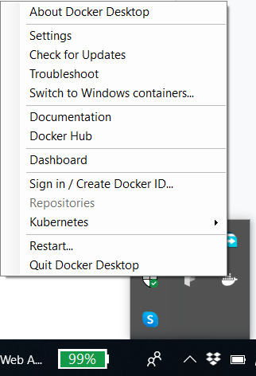
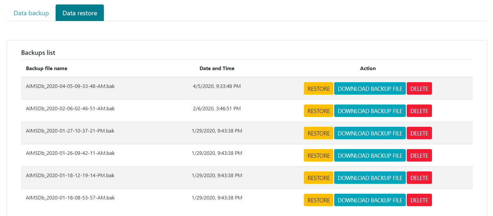
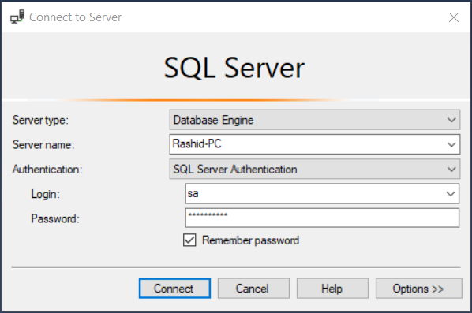
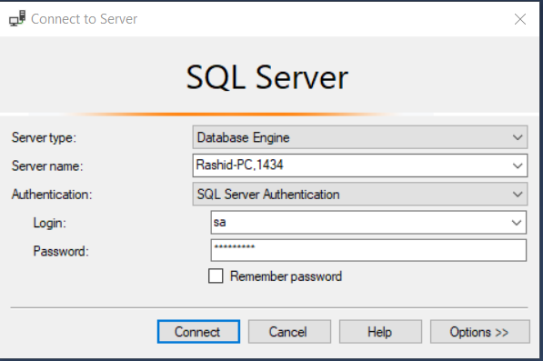

**AIMS Deployment Guide using Docker**

This document is a guide to run AIMS using Docker. To make it easy for an end user to set up and run the application within the docker container the guide is written in a step by step manner. There are two parts of the application, the backend and the frontend. The backend includes setting up SQL Server and APIs server. Before following this guide, install the docker on your system. Once you set up docker on your system, we are ready to deploy AIMS using docker.

**1. Setting up Docker**

Installing Docker on Windows or Linux (Ubuntu) is easy. Please refer to the official documentation along with step by step help here ([https://docs.docker.com/install/](https://docs.docker.com/install/)). For downloading Docker for Windows 10, use the link given below:

([https://docs.docker.com/docker-for-windows/install/](https://docs.docker.com/docker-for-windows/install/)).

If you are using Windows, please switch to Linux containers before running the command given below. The figure below shows how you can switch the containers on windows.

**Figure 1: Switching docker containers on windows**

**Step ****2. Setting up SQL Server**

We will first setup the SQL Server using the Linux image within a docker container. Open the terminal (On windows open Powershell) and type the following command to pull the docker image for SQL Server.

**Figure 2: Installing SQL Server 2017 using Docker**

<table>
  <tr>
    <td>docker pull mcr.microsoft.com/mssql/server:2017-latest</td>
  </tr>
</table>

This command will pull the image for SQL Server into the container. Once the image is downloaded, we can install SQL Server with some configuration using the command below:

**Figure 3: Running SQL Server**

<table>
  <tr>
    <td>docker run -e 'ACCEPT_EULA=Y' -e 'SA_PASSWORD=Master002!' -p 1433:1433 --name sqlserver  -d mcr.microsoft.com/mssql/server:2017-latest</td>
  </tr>
</table>

The given command runs SQL Server within the container. Different chunks of the command are explained in the table below.

**Table 1: Explanation of command for running SQL Server Image**

<table>
  <tr>
    <td>Attribute</td>
    <td>Explanation</td>
  </tr>
  <tr>
    <td>ACCEPT_EULA=Y</td>
    <td>Accepting the license agreement</td>
  </tr>
  <tr>
    <td>SA_PASSWORD</td>
    <td>"sa" is a system administrator user, and this attributes provides the password required to run the SQL Server Instance </td>
  </tr>
  <tr>
    <td>-p 1433:1433</td>
    <td>Specifies port, left side of port is the port on host computer on which docker is installed, right side of the port is on which SQL Server is running within the docker container

Note:- Please note port 1433 (right side) from the docker container is mapped to port 1433 (left side) on the host computer. Sometimes, it happens the port 1433 is already taken on the host computer and in this case the container will not run. Please change the port which is on the left side to some other port number e.g “1434”. After you run the command, please use the command “docker ps -a” to check the status of the container. If it is showing “Up” under the status column. You are ready to run the next command. </td>
  </tr>
  <tr>
    <td>--name</td>
    <td>Name of the container</td>
  </tr>
</table>

 

**3. Pulling and running the backend image from Docker Hub**

Once we are done with setting up the SQL Server on a docker container. We can now step forward to set up the backend APIs for AIMS. Steps are given below in order to setup the backend APIs.

**3.1. Pull Image from Docker Hub**

**Figure 4: Pull AIMS APIs Image from Docker Hub**

<table>
  <tr>
    <td>docker pull somaliaims/aimsapis:release1</td>
  </tr>
</table>

**3.2. Run APIs Server**

Once the image is pulled successfully. We are now ready to run the APIs server. The image that we have downloaded is name as "somaliaims/aimsapis". Use the command below to setup and run the AIMS APIs Server.

**Figure 5: Running AIMS APIs Server**

<table>
  <tr>
    <td>docker run -it --rm --link sqlserver -e 'SQLSERVER_HOST=sqlserver' -e 'SQLSERVER_SA_PASSWORD=Master002!' -p 5000:80 somaliaims/aimsapis:release1 --name aims-server</td>
  </tr>
</table>

If the commands runs successfully, that means the AIMS API Server is set up and you can view it using the URL [http://localhost:](http://localhost:5000/swagger/)[5000](http://localhost:5000/swagger/)[/swagger/](http://localhost:5000/swagger/)  on the host computer. The breakdown and explanation of the command given in figure 5 is described in the table below.

**Table 2: Explanation of command for setting up AIMS APIs Server**

<table>
  <tr>
    <td>Attribute</td>
    <td>Explanation</td>
  </tr>
  <tr>
    <td>--link sqlserver</td>
    <td>Link attribute connects the current container with the container named after this attribute. In this case it is ‘sqlserver’</td>
  </tr>
  <tr>
    <td>-e ‘SQLSERVER_HOST=sqlserver’</td>
    <td>This parameter is passing the name of the SQL Server container which we started in the previous command given in Figure 3. Passing this container name will be used as a connection string.</td>
  </tr>
  <tr>
    <td>-e ‘SQLSERVER_SA_PASSWORD’</td>
    <td>This is the password for ‘sa’ user</td>
  </tr>
  <tr>
    <td>-p 5000:80</td>
    <td>P parameter is for port, the port on the left is the one using which we can access the application from the host computer. The port on the right side is the one on which the application is listening within the container.

Note:- We can expose any port number to the host computer. For example, we can use 5001 instead of 5000 </td>
  </tr>
</table>

 

**4. Pulling and running the frontend image from Docker Hub**

Setting up front is also a two step process. We can download the image for the frontend using the command given below.

**4.1. Pull Image from Docker Hub**

**Figure 5: Pulling Frontend Image from Docker Hub**

<table>
  <tr>
    <td>docker pull somaliaims/aimsui:release1</td>
  </tr>
</table>

The command will pull the Image for AIMS UI. Once the pull is completed, we are ready to run the UI Client.

**4.2. Run Frontend Client**

Use the command below to run the client after pulling the image (somaliaims/aimsui) from the Docker Hub.

**Figure 6: Running Frontend Application**

<table>
  <tr>
    <td>docker run -p 7000:82 --env BACKEND_API_URL=http://localhost:5000/api/  somaliaims/aimsui:release1 --name aimsui-client</td>
  </tr>
</table>

The breakdown of the command and its explanation is given in the table below.

**Table 3: Explanation of command for setting up AIMS APIs Server**

<table>
  <tr>
    <td>Attribute</td>
    <td>Explanation</td>
  </tr>
  <tr>
    <td>--env BACKEND_API_URL</td>
    <td>--env is an attribute used for the environment, whereas BACKEND_API_URL is a constant configured in the UI application to get and set up the URL for APIs Server. We have set up our API server on port 5000. So in this case it would be http://localhost:5000/api/ </td>
  </tr>
  <tr>
    <td>--name aims-ui-client</td>
    <td>--name is an attribute which is used to set the name of the container in the given command</td>
  </tr>
</table>

If everything is executed smoothly, we can then access our UI client using this URL: [http://localhost:7000/](http://localhost:7000/).

X **5. AIMS Management**

Once all set up and AIMS is running, we can login with the default manager account already created during database initialization to manage the basic data. The default account information is given below:

**Table 4: Default Manager Account Information**

<table>
  <tr>
    <td>Username</td>
    <td>Password</td>
  </tr>
  <tr>
    <td>aims.developer18@gmail.com</td>
    <td>test</td>
  </tr>
</table>

After you login with the manager account, you will see new menu items appear on the menu bar. There are many sections for which data has been initialized during the data initialization process. In some sections data is grabbed from IATI sources. The table below describes different management sections and the data initialized. 

**Table 5: Management sections and data setup**

<table>
  <tr>
    <td>Section</td>
    <td>Initialized data</td>
    <td>Action on your end</td>
  </tr>
  <tr>
    <td>Locations</td>
    <td>By default only location named as "Unattributed" is initialized. </td>
    <td>The manager needs to enter other locations required</td>
  </tr>
  <tr>
    <td>Sector types</td>
    <td>During the very first step of AIMS Setup data is grabbed from IATI and sector types are entered into the database. Script to grab and parse the latest IATI is executed every midnight.</td>
    <td>Enter the required sector type (For example, Somali sectors) before using AIMS </td>
  </tr>
  <tr>
    <td>Sectors</td>
    <td></td>
    <td>Manager user will enter sectors data</td>
  </tr>
  <tr>
    <td>Sectors mapping</td>
    <td>All IATI Sectors are extracted by AIMS</td>
    <td>Mappings are entered by the manager user</td>
  </tr>
  <tr>
    <td>Currencies</td>
    <td>Currencies are loaded from open exchange at the very first setup of AIMS. Make sure you are connected to Internet while setting up AIMS</td>
    <td>User need to set the default and national currencies before using AIMS</td>
  </tr>
  <tr>
    <td>Exchange rates</td>
    <td>AIMS will suggest exchange rates to manager users during entering the annual exchange rate. However, users can edit the suggested rate during entry.</td>
    <td>Manager users need to enter annual exchange rates</td>
  </tr>
  <tr>
    <td>Funding types</td>
    <td>AIMS will by default initialize AIMS with two funding types (Grant, Loan)</td>
    <td>Manager users can enter other types if required</td>
  </tr>
  <tr>
    <td>Financial year settings</td>
    <td>AIMS will setup the database to start the financial year by January 1st</td>
    <td>Manager users can change these settings. However this change will affect disbursements and project value</td>
  </tr>
  <tr>
    <td>Markers</td>
    <td>If any data is imported through AIMS, then you will see a list of markers.</td>
    <td>Manager user can create/manage new markers</td>
  </tr>
  <tr>
    <td>Help text</td>
    <td>By default not set</td>
    <td>Manager user needs to set this help text for data entry fields</td>
  </tr>
  <tr>
    <td>Notifications</td>
    <td>AIMS will generate notifications</td>
    <td>Relevant user needs to take action according to type of notification</td>
  </tr>
  <tr>
    <td>Account management</td>
    <td></td>
    <td>User can change password and delete account</td>
  </tr>
  <tr>
    <td>Manage users</td>
    <td></td>
    <td>Manager users can promote or demote user accounts</td>
  </tr>
  <tr>
    <td>Organization types</td>
    <td></td>
    <td>Manager user needs to set up the organization types</td>
  </tr>
  <tr>
    <td>Organizations</td>
    <td></td>
    <td>Manager user needs to set up organizations </td>
  </tr>
  <tr>
    <td>Envelope types</td>
    <td>By default AIMS initializes two types (Humanitarian, Development)</td>
    <td>Manager user may create/manage other types</td>
  </tr>
  <tr>
    <td>Home page settings</td>
    <td>By default basic text is set by AIMS</td>
    <td>Manager user can change the Introduction text on the home page</td>
  </tr>
  <tr>
    <td>IATI Settings</td>
    <td>AIMS by default sets the URL for IATI datastore for data related to Somalia.</td>
    <td>Manager user can change the URL.</td>
  </tr>
  <tr>
    <td>Email messages</td>
    <td>AIMS by default initializes the subjects for emails supported by AIMS</td>
    <td>Manager users can change the texts for email messages.</td>
  </tr>
  <tr>
    <td>Email users</td>
    <td></td>
    <td>Manager users may send emails to users when required.</td>
  </tr>
</table>

**5.1. Data backup and restore**

This section discusses the data backup and restore features for AIMS. In this regard this section is of great importance while devising a plan for data backups. To backup the data use Management menu, then go to section AIMS database management, and use Data backup and restore menu item.

One of the important questions could be, how frequent one needs to take data backup? This is totally up to the usage of AIMS and then your strategy to define an interval accordingly. It is recommended that backups you take must be downloaded and be stored in a safe place. The backups normally work the way given below.

* Take the data backup. The database backup will be executed as of its current state of the database.

* One backup is executed successfully. You may download the latest file to your local computer and save it on a drive.

* It should be noted that while you are backing up the data, AIMS will not be able to provide its services until it is backed up. The backup process normally takes a few seconds, or it may take a little longer and depends upon the size of the database.

* Once a backup is taken successfully. It will become available to be restored at a later stage.

* You may take the backup of the database as per your own strategy, for example, twice a week or once a week.

 

The figure below shows a snapshot of the page listing the backups and options available.

**Figure 7: AIMS database backup**

 

**5. SQL Server Management**

This section discusses how to connect to a SQL Server that is running within the container from the host computer. To start with this section, first setup SQL Server Management Studio (SSMS) on your system. You may download SSMS using the information below.

	**Table 6: Downloading and Setting up SSMS**

<table>
  <tr>
    <td>Operating Systems</td>
    <td>Link</td>
  </tr>
  <tr>
    <td>Windows</td>
    <td>https://docs.microsoft.com/en-us/sql/ssms/download-sql-server-management-studio-ssms?view=sql-server-ver15</td>
  </tr>
  <tr>
    <td>Linux</td>
    <td>https://docs.microsoft.com/en-us/sql/linux/sql-server-linux-manage-ssms?view=sql-server-ver15 </td>
  </tr>
</table>

Once we set up the SSMS on our system, we are ready to connect to SQL Server database engine. Referring to figure number 3, we wrote a docker command to run SQL Server within the docker container and mapped it to the port 1433 on the host system. Now we will access this SQL Server instance using SSMS on the host system. Figure 7 and Figure 8 below shows a sample of connection parameters to an instance of SQL Server running within docker container.

**Figure 7: Login to SQL Server with default port (1433)**

The figure below shows a snapshot of the login screen for a scenario where SQL Server is mapped to some other port other than the default port which is 1433. Suppose the SQL Server instance is mapped to port 1434 on the host system.

**Figure 8: Login to SQL Server with custom port (For example: 1434)**

